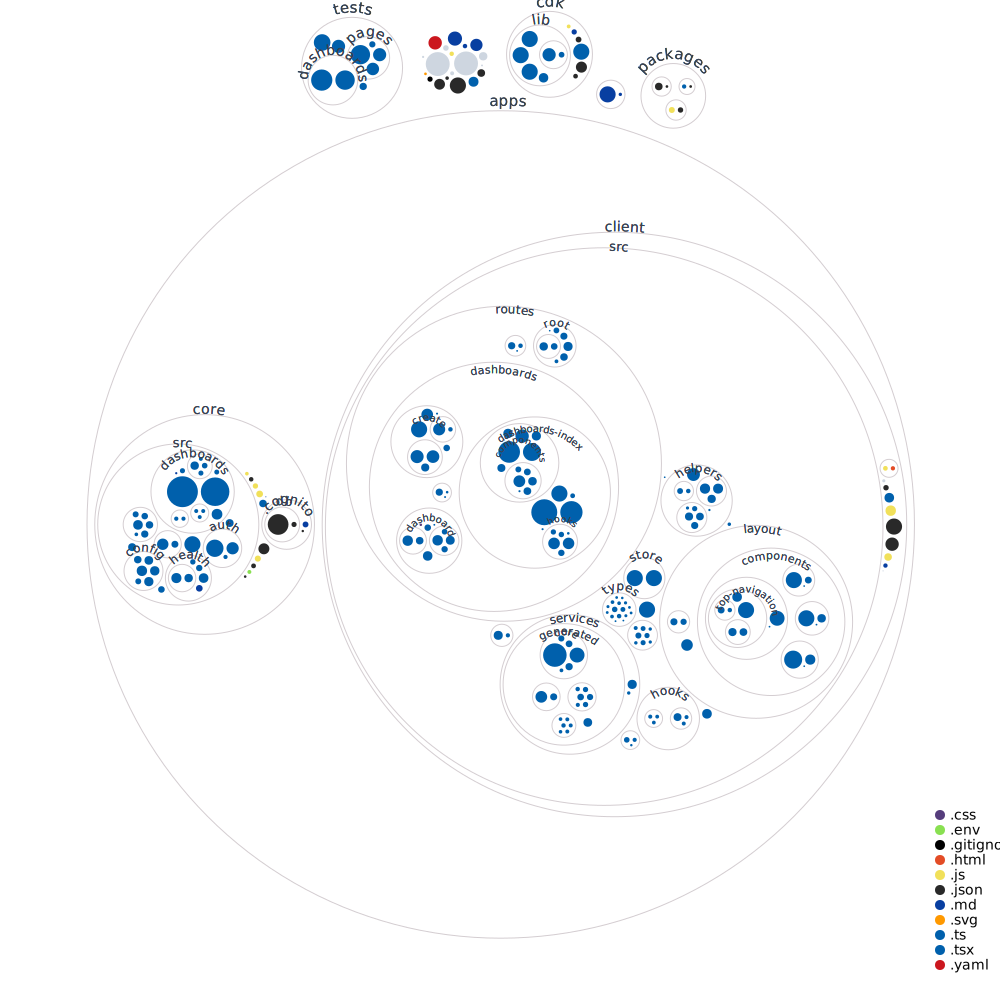

# IoT Application

IoT Application is an easy-to-use tool designed for businesses and individuals who need to keep track of their IoT devices and data. By creating and managing custom dashboards, you can effortlessly monitor your IoT devices and their data in real-time, connecting to your AWS IoT SiteWise data.

Whether you're in manufacturing, logistics, energy, or other industries relying on IoT devices, IoT Application can help you address specific challenges such as tracking equipment performance, optimizing operational efficiency, and making data-driven decisions.

Built using [IoT App Kit](https://github.com/awslabs/iot-app-kit), a library that simplifies connecting your applications to AWS IoT, IoT Application utilizes the AWS Cloud Development Kit (CDK) for a smooth deployment to AWS, ensuring a hassle-free setup process.

Key features of IoT Application include:
- **Dashboard management**: Easily create, modify, view, and organize dashboards
- **Dashboard customization**: Design unique dashboards tailored to your specific IoT data requirements
- **Intuitive interface**: Enjoy a user-friendly drag-and-drop experience for creating dashboards
- **Effortless deployment**: Use the AWS CDK to deploy the application
- **Secure authentication**: Safeguard your application with AWS Cognito for user management and authentication

Start using IoT Application today to quickly create, manage, and view your IoT data in real-time from assets in your AWS IoT SiteWise service. We encourage you to try the application, contribute to the project, and provide feedback to help us improve and enhance the application further.

## Prerequisites

1. Install [Volta](https://docs.volta.sh/guide/getting-started).
1. Install [Node.js@18 with Volta](https://docs.volta.sh/guide/#features).
1. Install [Yarn with Volta](https://docs.volta.sh/guide/#features).
1. Install global dependencies:
   ```sh
   yarn add global nest turbo typescript
   ```

## Getting Started with local development

1. Install application dependencies:
   ```sh
   yarn install
   ```
1. Start development server:
   ```sh
   yarn dev
   ```
1. Log in with local Cognito credentials found at `apps/core/.cognito/db`

## Running the tests locally

Run local test command `yarn test` to test the application. The command is "batteries included" - it has everything needed to run and test the application locally.

## Updating generated types locally

Run `yarn gen:types` in root while `yarn dev` is running.

## Deploying to AWS Cloud

This will deploy the application to AWS using CDK.

##### Cloud deployment prerequisites:

1. [Configure](https://docs.aws.amazon.com/cli/latest/userguide/cli-chap-configure.html) AWS CLI credentials for making AWS service calls to setup the application
1. Install docker: https://docs.docker.com/get-docker/. Docker must be running when you run the deployment commands.
1. For the initial deployment, bootstrap cdk in your account:
   ```sh
   yarn workspace cdk cdk bootstrap
   ```

##### Deployment to cloud:

Note: All commands should be run in the workspace root directory. We are using [yarn workspaces](https://classic.yarnpkg.com/lang/en/docs/workspaces/) to handle individual package commands.

1. Complete the [prerequisites](https://github.com/awslabs/iot-application/blob/main/README.md#prerequisites)
1. Add your AWS accountId and region [here](https://github.com/awslabs/iot-application/blob/main/cdk/bin/cdk.ts#L17) to setup the cdk envrionment.
1. Install application dependencies:
   ```sh
   yarn install
   ```
1. Deploy the Core service and resource dependencies:
   ```sh
   yarn workspace cdk cdk deploy --all
   ```
1. View your application resources in CloudFormation. If you go to the stack IotApp -> Outputs you can see the URL that the application will be available from.

To specify a stack name, use the --context (-c) option, as shown in the following example.

```sh
yarn workspace cdk cdk deploy -c stackName=my-stack-name
```

## AWS IAM Identity Center (SSO) integration:
If you wish to use IAM Identity Center as your authentication source, there are some manual steps to complete first.

This integration is based on [these integration instructions](https://repost.aws/knowledge-center/cognito-user-pool-iam-integration).

#### Gather information from Cloudformation
Go to the CloudFormation console to get required resource information. You will need to take note of the following values: `domain-prefix`, `userpool-id`, `client-id` and `signin-url`. These will be used to configure IAM Identity Center as an authentication source.
1. Find the stack called `IotApp`
   * Go to the outputs tab and note down the value for `AppUrl` as the `signin-url` that will be used later.
1. Find the stack called `IotAppAuth`
   * Go to the resources tab and expand the Auth section.
   * Note down the physical id value for `UserPoolDomain` as `domain-prefix`
   * Note down the physical id value for `UserPool` as `userpool-id`
   * Note down the physical id value for `UserPoolClient` as `client-id`
#### Configure IAM Identity Center
Configure an IAM Identity Center application to be used for authentication. Visit the IAM Identity Center console. Activate IAM Identity Center if it is not already setup.
1. Go to applications
1. Choose `Add application` and `Add custom SAML 2.0 application`.
   * Enter a name and description
1. Note down the URL of the `IAM Identity Center SAML metadatafile` as `metadata-url`
1. Click next and assign any SSO users you want to be able to access this application
1. Add environment information at bottom of page. Here you will need some of the values noted earlier.
   * Application start URL = `https://<domain-prefix>.auth.<region>.amazoncognito.com/login?response_type=token&client_id=<client-id>&redirect_uri=<signin-url>`
   * ACS URL = `https://<domain-prefix>.auth.<region>.amazoncognito.com/saml2/idpresponse`
   * Application SAML audience = `urn:amazon:cognito:sp:<userpool-id>`
1. Save changes
1. Manually add metadata values
   * From the application page you just created, go to actions &rarr; Edit attribute mapping
   * Fill in subject value with `${user:subject}` and choose `Persistent`
   * Add a new metadata field with values `email`, `${user:email}` and choose `Basic`
   * Save changes
#### Configure Cognito to use IAM Identity Center
Configure your cognito identity pool for identity center integration.
1. Configure user pool to use IAM Identity Center
   * Go to the cognito console and find the userpool that was just created
   * Go to sign-in experience &rarr; federated sign-in &rarr; add an identity provider
   * Check `Add sign-out flow` which is required for sign-out to work
   * Under metadata document, enter hte metadata URL you noted earlier
   * Configure the SAML attriute mapping
      * Choose email, and for `User pool attribute`, type `Email`
   * Save changes
1. Choose IAM Identity Center as the user pool auth source
   * Go to the cognito console and find the userpool that was just created
   * Under the `App Integration` tab, click on the app client in the `app client list` section
   * Click `edit Hosted UI`
   * Change the value of URL to `signin-url` we noted earlier
   * Under the `Identity Proider`, select the IAM identity center application created earlier and uncheck cognito
   * Save changes
#### Sign in using IAM Identity Center for the application
Log in using IAM Identity Center. This url is different from the original cognito sign-in url.
   * Visit `https://<domain-prefix>.auth.<region>.amazoncognito.com/login?response_type=token&client_id=<client-id>&redirect_uri=<signin-url>` to sign in using IAM Identity Center as the authentication source for the application. The variables here are the same as the ones noted earlier from Cloudformation.

User management is handled from the IAM Identity Center console.

#### Sign out
1. Click the `sign-out` button in the application, you will be redirected to the IAM Identity Center applications page. 
1. Click the signout button in the top right navigation of this page to complete signing out of the application.

## Environments

### Service Dependencies

The table below lists the service dependencies for different environments.

| Category\Environments | [Local Development](#getting-started-with-local-development)   | [Local Test](#running-the-tests-locally)                              |
| --------------------- | -------------------------------------------------------------- | --------------------------------------------------------------------- |
| Authentication        | [cognito-local](https://www.npmjs.com/package/cognito-local)   | [cognito-local](https://www.npmjs.com/package/cognito-local)          |
| App API Database      | [dynamodb-local](https://www.npmjs.com/package/dynamodb-local) | [dynamodb-local](https://www.npmjs.com/package/dynamodb-local)        |
| App API Authorization | [cognito-local](https://www.npmjs.com/package/cognito-local)   | [JWT generated from secret](./apps/core/src/testing/jwt-generator.ts) |

## Project Structure



## Security

See [CONTRIBUTING](CONTRIBUTING.md#security-issue-notifications) for more information.

## License

This project is licensed under the Apache-2.0 License.
