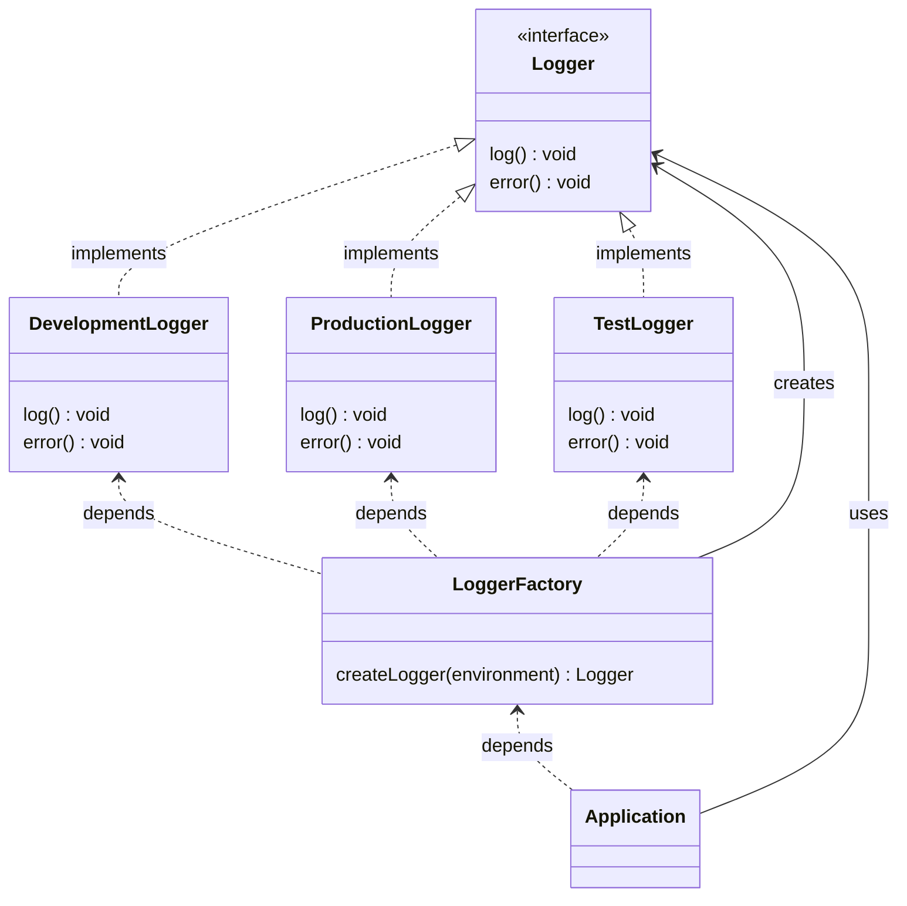

# IoT Application Architecture

Diagrams are generated using Mermaid. Usage of a live Mermaid editor is recommended when creating diagrams.

## Logger

```mermaid
classDiagram
  class Logger {
    <<interface>>   
    log() void
    error() void
  }
   
  class DevelopmentLogger {
    log() void
    error() void
  }

  class ProductionLogger {
    log() void
    error() void
  }

  class TestLogger {
    log() void
    error() void
  }

  class LoggerFactory {
    createLogger(environment) Logger
  }

  DevelopmentLogger <.. LoggerFactory : depends
  ProductionLogger <.. LoggerFactory : depends
  TestLogger <.. LoggerFactory : depends

  LoggerFactory <.. Application : depends
  LoggerFactory --> Logger : creates

  Logger <-- Application : uses

  Logger <|.. DevelopmentLogger : implements
  Logger <|.. ProductionLogger : implements
  Logger <|.. TestLogger : implements
```
