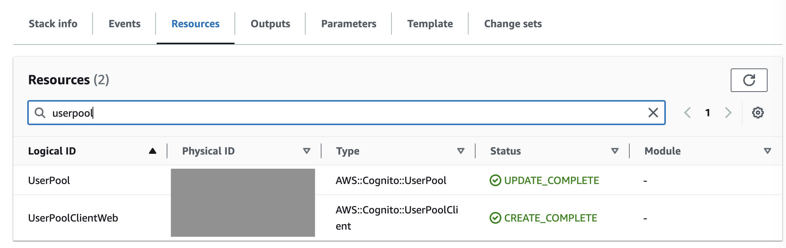
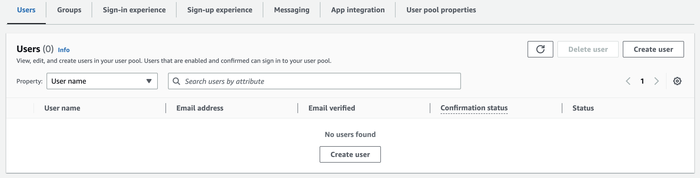
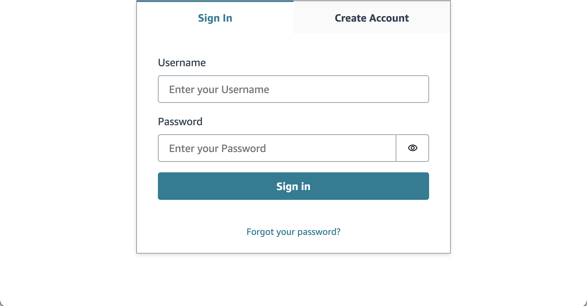
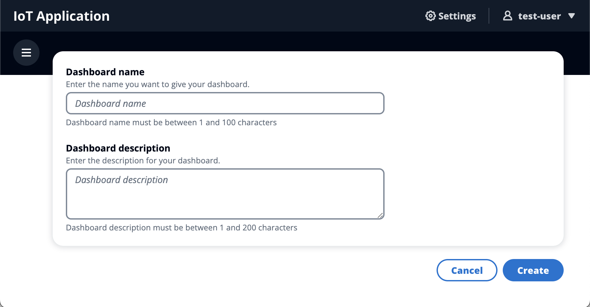
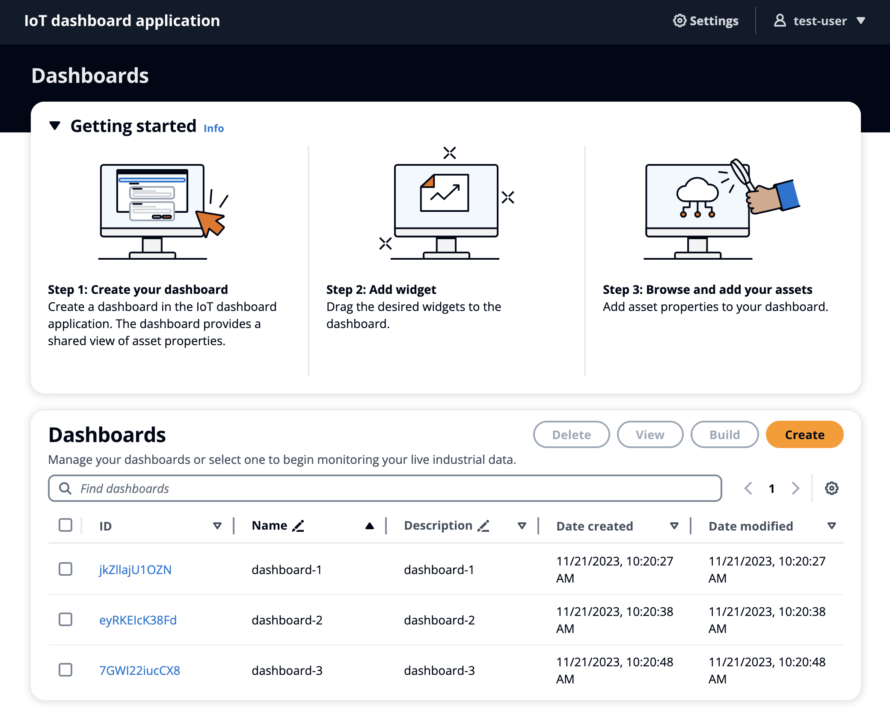
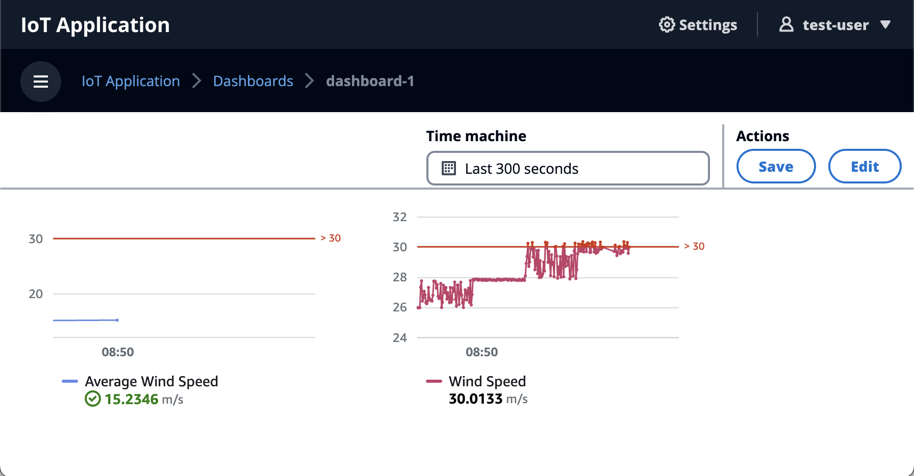
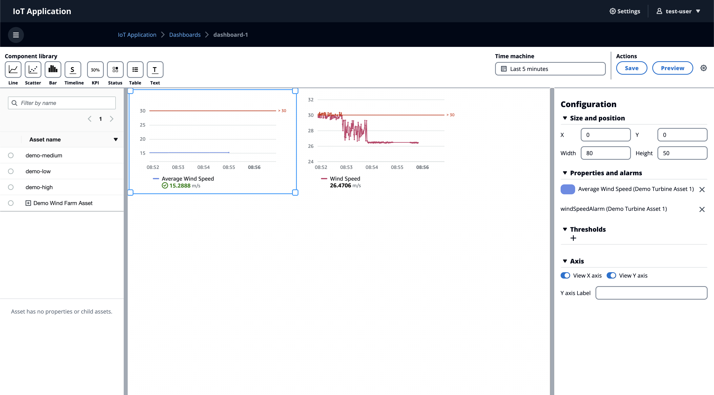
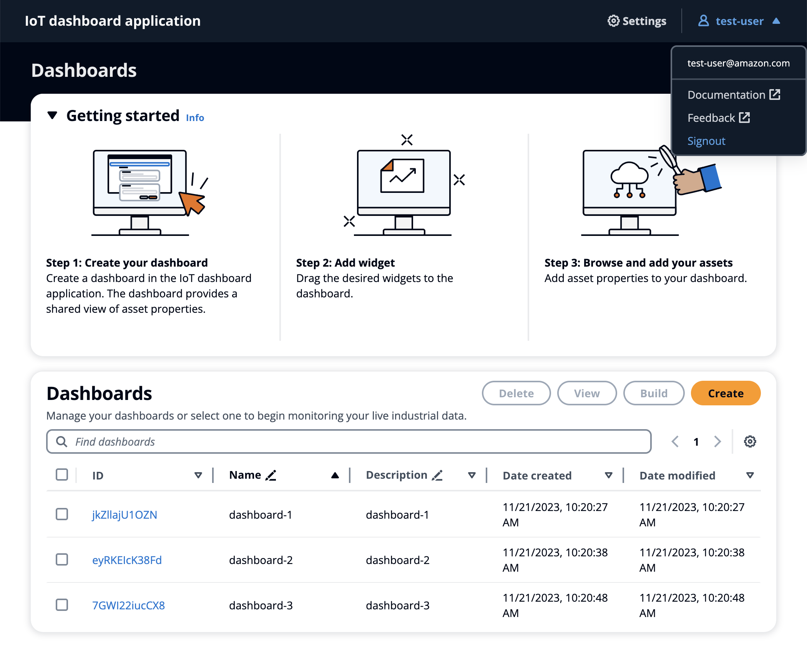

# IoT Application User Guide

## Introduction

IoT Application helps businesses and application users keep track of their IoT devices and data. By creating and managing custom dashboards, you can monitor your IoT devices and their data in real-time and connect to your AWS IoT SiteWise data. 

## Prerequisites

If you don't have the IoT Application feature, contact your AWS administrator. For information about how to create a portal, see Getting started in the repository's [README.md](../README.md).

## User Creation

NOTE: To prevent unwanted signups, that option is disabled.

An AWS administrator can create application users by following these steps:

1. Find the IoT Application **UserPool** by searching `UserPool` on the CloudFormation stack for IoT Application.
    
1. Choose the **Physical ID** link. This displays the **UserPool** on the **Amazon Cognito** console.
    
1. To create a new user: On the **UserPool** page, in the **Users** tab, choose **Create user**.

## User Login

1. On your browser, enter the IoT Application URL. 
    
1. Input your user **name** and **password** and click the **Sign in** button.
1. You will be routed to the IoT Application home page.

## Create Dashboards

1. On the **dashboards** page, choose **Create dashboard**.
    
1. To create your own dashboard, enter the dashboard information.
1. Choose **Create** to create the dashboard.
1. After the dashboard is created, you will be routed to the newly created dashboard.
1. You can modify the dashboard with intuitive drag-and-drop support.

## List Dashboards

1.  On the **dashboards** page, find the dashboards table.
    
1. You can perform the following actions on the **dashboards** page:
    1. **Update dashboard information**
    1. **Delete dashboards**
    1. **Search dashboards**
    1. **Configure table preferences**
    1. **Configure table column sort**

## View Dashboards

1. To view the dashboard: On the **dashboards** page, choose the dashboard name.
    
1. You can toggle between **Preview** and **Edit** modes.

## Update Dashboards

1. On the **dashboards** page, under **Edit** mode, you can modify the dashboard.
    
1. You can update your dashboard with different combinations of the following:
    1. **Asset properties**
    1. **Components**
    1. **Component configuration**
    1. **Time machine**
1. Choose **Save** to save your updates.

## Sign out

1. On any page, choose the user icon (name) to sign out. 
    
1. After you sign out, you will be routed to the sign in page.
