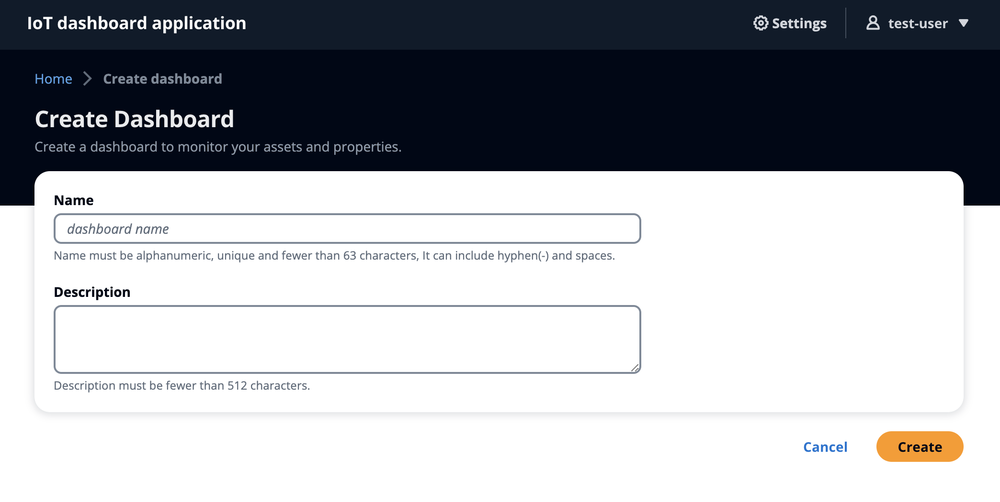

# IoT Application User Guide

## Introduction

IoT Application is an easy-to-use tool designed for businesses and individuals who need to keep track of their IoT devices and data. By creating and managing custom dashboards, you can effortlessly monitor your IoT devices and their data in real-time, connecting to your AWS IoT SiteWise data.

## Prerequisites

If you don't have an IoT Application, contact your AWS administrator. For information about how to create a portal, see Getting started in the repository's [README.md](../README.md).

## User Creation

NOTE: Signup experience is disabled to prevent unwanted sign-up.

AWS administrator can create application users under the Cognito console:

1. Find the IoT Application **UserPool** by searching `UserPool` on the IoT Application's CloudFormation stack.
    
1. Click the **Physical ID** link to view the **UserPool** on **Cognito** Console.
    
1. On the **UserPool** page, go to the **Users** tab, and click **Create user** button to create a new user.

## User Login

1. Obtain your user **name** and **password** and the IoT Application URL from your AWS administrator.
1. Visit the IoT Application URL on your browser.
    
1. Input your user **name** and **password** and click the **Sign in** button.
1. You should be routed to the IoT Application home page.

## Create Dashboards

1. Go to the **dashboards** page, click on the **Create dashboard** button to create a dashboard.
    
1. Fill out the dashboard information to create your own dashboard.
1. Click **Create** to create the dashboard.
1. After the dashboard is created, you will be routed to the newly created dashboard.
1. You can modify the dashboard with intuitive drag and drop support.

## List Dashboards

1. Go to the **dashboards** page to view the dashboards table.
    
1. You can perform the following actions on the **dashboards** page:
    1. **Update dashboard information**
    1. **Delete dashboard(s)**
    1. **Search dashboards**
    1. **Configure table preferences**
    1. **Configure table column sort**

## View Dashboards

1. On the **dashboards** page, click on a dashboard name to view the dashboard.
    
1. You can toggle between **Preview** and **Edit** modes.

## Update Dashboards

1. On the **dashboards** page under **Edit** mode,  you will be able to modify the dashboard.
    
1. You can update your dashboard with different combination of
    1. **Asset properties**
    1. **Components**
    1. **Component configuration**
    1. **Time machine**
1. Click on **Save** to save the dashboard

## Sign out

1. On any page, click on the user icon / name to sign out.
    
1. Once signed out, you will be routed to the sign in page.
